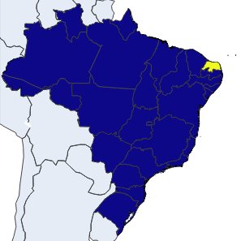

.. |Github License| image:: https://img.shields.io/github/license/filipegmedeiros/brazilian_choropleth_map?style=for-the-badge
.. |Github Issues| image:: https://img.shields.io/github/issues/filipegmedeiros/brazilian_choropleth_map?style=for-the-badge
.. |Github Commit| image:: https://img.shields.io/github/last-commit/filipegmedeiros/brazilian_choropleth_map?style=for-the-badge

|Github License| |Github Issues| |Github Commit|

=================
Table of contents
=================

- `Razão`_
- `Geojson`_
- `Como Rodar`_
- `Disclaimer`_
- `Contribuições`_

=======
Razão
=======
Não achei uma forma fácil no Google de criar um Choropleth Map do Brasil utilizando a ferramenta Plotly.express. Porque a maioria dos exemplos de plotagens desse gráfico são baseados apenas nos Estados Unidos. Dado isso, criei esse repositório para facilitar a vida de quem precisar

=======
Geojson
=======
Na pasta ./geojson existe dois arquivos:

- brasil_completo.json
- brasil_estados.json

onde no brasil_completo possui as coordenadas das cidades
e no brasil_estado apenas os estados.

============
Como Rodar
============
Para rodar esse Notebook basta seguir os seguintes passos:

.. code-block:: bash

    git clone https://github.com/filipegmedeiros/brazilian_choropleth_map.git
    cd brazilian_choropleth_map

.. code-block:: python

    python -m venv .
    source ./bin/activate
    pip install -r requirements
    jupyter notebook
    
Por fim vá na pasta do notebook e abra o FP4.ipynb
e rode o código :)

=============
Disclaimer
=============

A parte do Dash App faz parte da disciplina do `Ivanovich <https://github.com/ivanovitchm>`_
chamada `Ciencia de Dados <https://github.com/ivanovitchm/datascience2020.6>`_. Ele gera um dashboard iterativo =)

=============
Contribuições
=============

As contribuições ficam para o meu colega `Pedro Carvalho <https://www.linkedin.com/in/pedro-carvalho-143009164/>`_ (Desenvolvedor backend na Mundiale), onde fizemos Pair Programming para resolver o problema citado.
Também aos repositórios que disponibilizaram o geoJson:

- `geodata-br <https://github.com/tbrugz/geodata-br>`_
- `Conjunto-de-Dados <https://github.com/datalivre/Conjunto-de-Dados>`_
